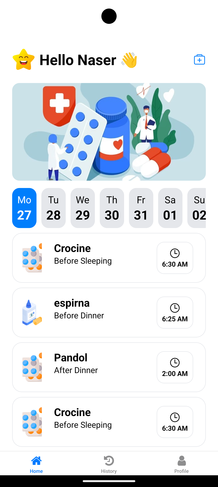

<a name="readme-top"></a>

<br />
<div align="center">
  <a href="https://github.com/priyanshubh/Mediminder">
    
  </a>

  <h3 align="center">Mediminder</h3>

  <p align="center">
    Your Personal Medication Assistant. Never miss a dose again.
    <br />
    <br />
    <a href="https://github.com/priyanshubh/Mediminder">View Code</a>
    ·
    <a href="https://github.com/priyanshubh/Mediminder/issues">Report Bug</a>
    ·
    <a href="https://github.com/priyanshubh/Mediminder/issues">Request Feature</a>
  </p>
</div>

<div align="center">
  
  
  
  
  
</div>

<br />

<details>
  <summary>Table of Contents</summary>
  <ol>
    <li><a href="#-about-the-project">About The Project</a></li>
    <li><a href="#-key-features">Key Features</a></li>
    <li><a href="#-tech-stack">Tech Stack</a></li>
    <li><a href="#-folder-structure">Folder Structure</a></li>
    <li><a href="#-getting-started">Getting Started</a></li>
    <li><a href="#-contributing">Contributing</a></li>
    <li><a href="#-contact">Contact</a></li>
  </ol>
</details>

---

## 🤖 About The Project

**Mediminder** is a user-friendly React Native application built with Expo designed to simplify medication management. It helps users adhere to their medical prescriptions by allowing them to schedule reminders, track their medication history, and manage their health profile.

Whether you are managing a simple vitamin routine or a complex medication schedule, Mediminder ensures you stay on track with timely notifications and an easy-to-use interface.

<div align="center">
  
</div>

---

## 🔥 Key Features

- **🔔 Smart Reminders**
  Set up precise notifications for your medication to ensure you never miss a dose.
  
- **➕ Easy Medication Entry**
  Intuitive forms (`AddMedicationForm`) to quickly add new medicines with dosage and timing details.

- **📜 Medication History**
  Keep a log of your taken medications and adherence history via the dedicated History tab.

- **🔐 Secure Authentication**
  Integrated **Firebase Auth** for secure Sign In and Sign Up functionality.

- **👤 User Profile**
  Manage personal details and app settings through a dedicated Profile section.

- **📱 Cross-Platform**
  Built with Expo to run smoothly on Android devices.

---

## ⚙️ Tech Stack

| Category | Technology | Description |
| :--- | :--- | :--- |
| **Framework** |   | Built using Expo SDK and Expo Router for navigation. |
| **Backend & Auth** |  | Firebase used for Authentication and potentially real-time data. |
| **Styling** |  | Custom styling using React Native StyleSheet and constant color tokens. |
| **Language** |  | Logic written in JavaScript/JSX with TypeScript configuration. |

---

## 📂 Folder Structure

The project follows a modular Expo Router structure:

```text
Mediminder/
├── app/                  # Application Screens & Routes
│   ├── (tabs)/           # Bottom Tab Navigation (Home, History, Profile)
│   ├── login/            # Authentication Screens (SignIn, SignUp)
│   ├── add-new-medication/ # Screen for adding new reminders
│   └── _layout.jsx       # Root Layout configuration
├── components/           # Reusable UI Components
│   ├── AddMedicationForm # Form logic for new inputs
│   ├── MedicationCardItem# UI for individual medicine items
│   ├── EmptyState        # Fallback UI when no data exists
│   └── ...
├── service/              # Logic Layers
│   ├── Storage.jsx       # Local data handling
│   └── ConvertDateTime   # Date formatting utilities
├── config/
│   └── FirebaseConfig.jsx# Firebase initialization
├── assets/               # Images, Fonts, and Icons
└── constant/             # App-wide constants (Colors, Strings)

```
---

## 🧰 Getting Started

Follow these steps to set up the project locally on your machine.

### Prerequisites

* **Node.js** (v18+)
* **Expo Go** app installed on your physical device or an Android Emulator.

### Installation

1. **Clone the repository**
```bash
git clone [https://github.com/priyanshubh/Mediminder.git](https://github.com/priyanshubh/Mediminder.git)
cd Mediminder

```


2. **Install dependencies**
```bash
npm install
# or
yarn install

```


3. **Configure Firebase**
* Go to `config/FirebaseConfig.jsx`.
* Ensure your Firebase API keys and configuration are correctly set up.


4. **Start the application**
```bash
npx expo start

```


* Scan the QR code with the **Expo Go** app (Android) or use an emulator.


---

## 🔧 Contributing

Contributions are welcome!

1. Fork the Project
2. Create your Feature Branch (`git checkout -b feature/NewFeature`)
3. Commit your Changes (`git commit -m 'Add NewFeature'`)
4. Push to the Branch (`git push origin feature/NewFeature`)
5. Open a Pull Request

---

## 🚀 Follow Me

<div align="center">
  <a href="https://github.com/priyanshubh">
    
  </a>
  <a href="https://linkedin.com/in/priyanshu-bharti">
    
  </a>
  <a href="https://priyanshubharti.vercel.app">
    
  </a>
</div>

<br />
<p align="center">Built with ❤️ by <a href="https://www.google.com/search?q=https://github.com/priyanshubh">Priyanshu Bharti</a></p>

